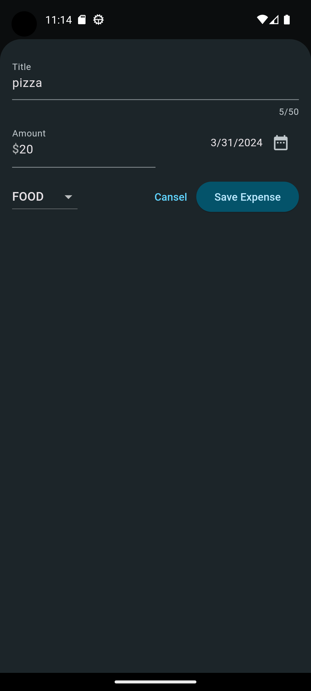

# expenses_tracker

Full functional Flutter expenses tracker mobile application.

## Getting Started

This project contains a Simple UI Full Functional Expenses Tracking Flutter mobile application, that gives the user the ability to register his new expenses after navigate to the new expense page.

## Registration

By filling the fields with the following info:

1. Expense Title.
2. Amount of the money.
3. Date of the expense (after clicking on the date icon).
4. Category of the expense (FOOD, TRAVEL, WORK, LEISURE).
5. Submitting using the (Save Expense) button.

## Features of the app With Screenshots

| Task                           | Screenshot                                           | Task                            | Screenshot                                           |
| ------------------------------ | ---------------------------------------------------- | ------------------------------- | ---------------------------------------------------- |
| Expenses Screen Light Mode     |            | Expense Registration Light Mode |             |
| Date Picker Light Mode         |  | Expenses Screen Dark Mode       |  |
| Expense Registration Dark Mode |              | Date Picker Dark Mode           |        |
| Products Details Screen        |  | Cart Screen                     |             |
| Wish List Screen               |          | Review Showing Screen           |    |
| Create Review Screen           |     |
